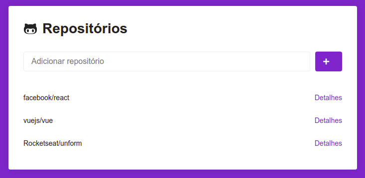
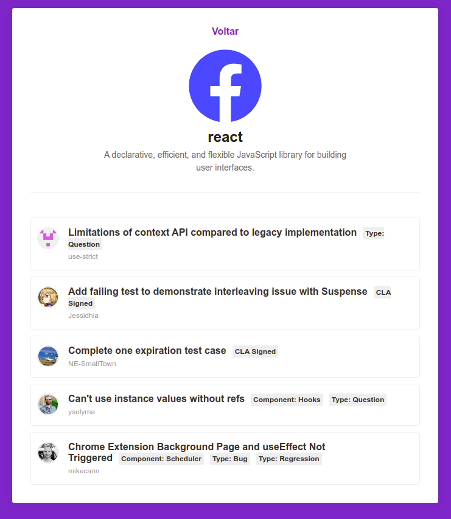

# repos-github-api

### Ver demo em [https://repos-github.netlify.com](https://repos-github.netlify.com)

Aplicativo construído durante o acompanhamento das aulas do bootcamp GoStack da Rocketseat. Contém também a resolução do desafio 05.

> Ver texto do desafio em [bootcamp-gostack-desafio-05](https://github.com/Rocketseat/bootcamp-gostack-desafio-05)

### Adicionando repositórios

### Listando as issues

